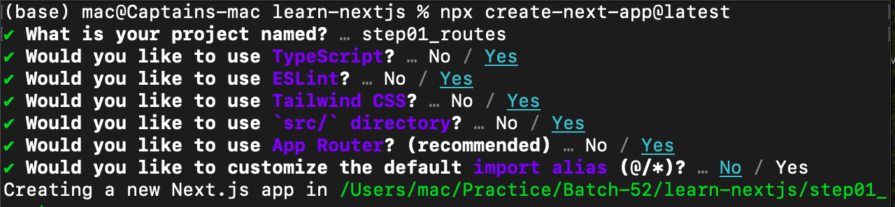
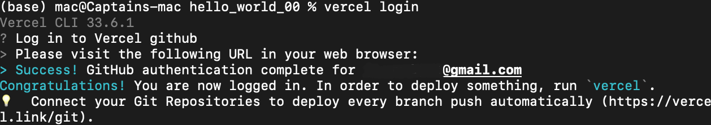

# Learn Modern Web Development using Next.js 13 in Baby Steps
## Some Basic Commands You need to know
### Create a New Next.js Project:
- Open your terminal or command prompt.
- Navigate to the directory where you want to create your project.
- Run the following command to create a new Next.js project:

```bash
npx create-next-app@latest my-first-nextjs-project
```
- Replace `my-first-nextjs-project` with your desired project name. 
- Navigate into your project directory using `cd my-first-nextjs-project`.

Make sure you select that options:


## How to Deploy Project on Vercel
### Install Vercel Globally
```bash
npm i -g vercel
```
### Login to Vercel on CLI
```bash
# It is a one time process
vercel login
```


### Now go to the Next.js project directory and give the following command to deploy to cloud
```bash
vercel
```
### Now If to want to update code on Vercel cloud:
```bash
vercel --prod
```
## Deploy Your Project Using GitHub:
- Ensure your project is pushed to a GitHub repository.
- In the Vercel dashboard, click on the "New Project" button.
- Select "Import Project" and choose your GitHub repository that contains your Next.js project.
- Vercel will automatically detect your Next.js project and suggest deployment settings. Proceed with the recommended settings.
- Click "Deploy" to start the deployment process. Vercel will build and deploy your project. 